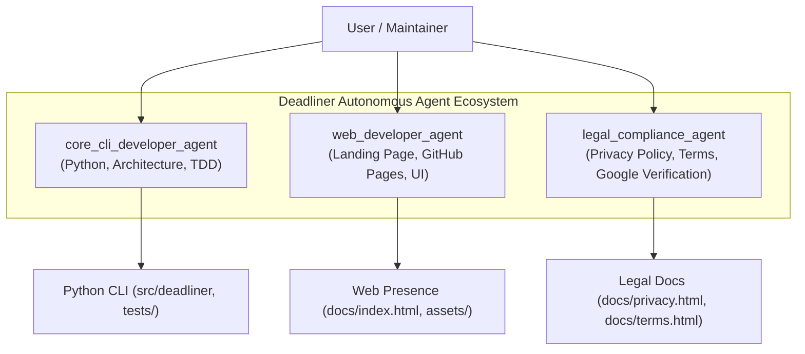

# AGENTS.md — Specialized Multi-Agent Architecture for Deadliner

## 1. Core Philosophy & Architectural Principles

Deadliner is built on principles derived from real-world student needs and rigorous software engineering practices (as documented in `docs/specs/PRD.md` and `docs/specs/design_doc.md`):

1. **Student-Centric Empathy (ADHD/Anxiety-Informed):**
   - Students live across fragmented portals (Moodle, Google Classroom, KSE Schedule).
   - Deadliner reduces cognitive load and anxiety. Every interface, notification, and color-coded event must be unambiguous (e.g. `midnight cutoff` distinctions, visual color codes: Red for deadlines, Green for lectures, Blue for practices).
2. **Local-First & Zero-Knowledge Privacy:**
   - Deadliner does **NOT** operate a backend server, database, or telemetry service.
   - All credentials (Moodle tokens, KSE tokens, Google OAuth tokens) are stored strictly locally in `~/.deadliner.json` and `~/.deadliner_google_token.json`.
   - Data flows directly between the user's computer and university/Google APIs.
3. **Fail Loudly & Honest Feedback:**
   - Anti-pattern strictly forbidden: *Silent 200 OK on bad authentication*.
   - If an auth token is expired or an API fails, raise `AuthError` / `ConnectionError` immediately with actionable troubleshooting tips (e.g. Google SSO password hints, 1-click clipboard instructions).
4. **Clean Architecture (No Junk-Drawer Classes):**
   - Anti-pattern strictly forbidden: *Giant "Manager" or "Helper" classes*.
   - Entities have single responsibilities: fetchers (`moodle_fetcher`, `classroom_fetcher`, `kse_fetcher`), formatters (`formatter`), synchronization engines (`calendar_sync`), and auth handlers (`auth`, `google_auth`, `kse_auth`).
5. **Code => Refactor => Test:**
   - No feature or fix is complete without comprehensive unit tests.
   - Fast execution (entire test suite runs in under 3 seconds using `responses` and `monkeypatch`).

---

## 2. Specialized Agent Roles

To achieve production readiness and prepare for public Google OAuth verification, the Deadliner team operates with three specialized agent roles:

### 🛠️ `core_cli_developer_agent` (Core CLI Developer)
- **Scope:** Python CLI, API integrations, data parsing, synchronization logic, test suite.
- **Rules:**
  - Follow the **Code => Refactor => Test** cycle.
  - Maintain type hints (`from __future__ import annotations`, `typing`).
  - Keep test coverage at 100% pass rate with zero regressions.
  - Ensure backward compatibility with existing configuration files and calendar event stable IDs (`extendedProperties.private.deadliner_id`).

### ⚖️ `legal_compliance_agent` (Legal & Compliance Specialist)
- **Scope:** Privacy Policy, Terms of Service, Google OAuth App Verification requirements.
- **Rules:**
  - Adhere strictly to **Google API Services User Data Policy** and **Limited Use requirements**.
  - Transparently disclose the exact scopes requested:
    - `calendar.events` (creating, updating, and removing Deadliner-managed events).
    - `classroom.coursework.me.readonly`, `classroom.coursework.students.readonly`, `classroom.courses.readonly` (reading course deadlines).
  - Explicitly certify: *Zero third-party tracking, zero data selling, zero remote storage. All data is processed locally on the client machine.*

### 🌐 `web_developer_agent` (Web & Landing Developer)
- **Scope:** Public-facing landing site, GitHub Pages deployment (`docs/index.html`), app branding, visual asset integration.
- **Rules:**
  - Lightweight, responsive, mobile-first design using clean HTML5/CSS3 (no heavy frameworks).
  - Embed the official 120x120px app logo (`docs/assets/logo.png`).
  - Provide clear navigation between the Home Page, Features Showcase, Privacy Policy, Terms of Service, and GitHub repository.

---

## 3. Google OAuth Verification Checklist (Public Project)

When configuring Google Cloud Console for public distribution:

| Requirement | Specification | Asset / Location |
|---|---|---|
| **App Name** | `Deadliner` | OAuth Consent Screen |
| **App Logo** | Square, 120x120px PNG/JPG, < 1MB | `docs/assets/logo.png` |
| **Application Home Page** | Public URL on Authorized Domain | `https://<user>.github.io/deadliner/` |
| **Privacy Policy Link** | Public URL detailing scope usage & data retention | `https://<user>.github.io/deadliner/privacy.html` |
| **Terms of Service Link** | Public URL detailing open-source license & terms | `https://<user>.github.io/deadliner/terms.html` |
| **Authorized Domain** | Domain hosting the pages | `github.io` |

---

## 4. Operational & Git Workflow

- **Branching Strategy:** 
  - Major feature/refactoring batches are developed in dedicated branches (e.g., `deadliner-2.0`) before merging into `main`.
- **Commit Standard:**
  - Conventional Commits: `<type>(<scope>): <message>`.
  - Allowed types: `feat`, `fix`, `refactor`, `style`, `docs`, `chore`, `ci`, `test`.
  - Author: `vkatsel <vkatsel@kse.org.ua>`.
- **Testing Gate:**
  - Every commit must pass all pytest unit tests (`pytest`).
