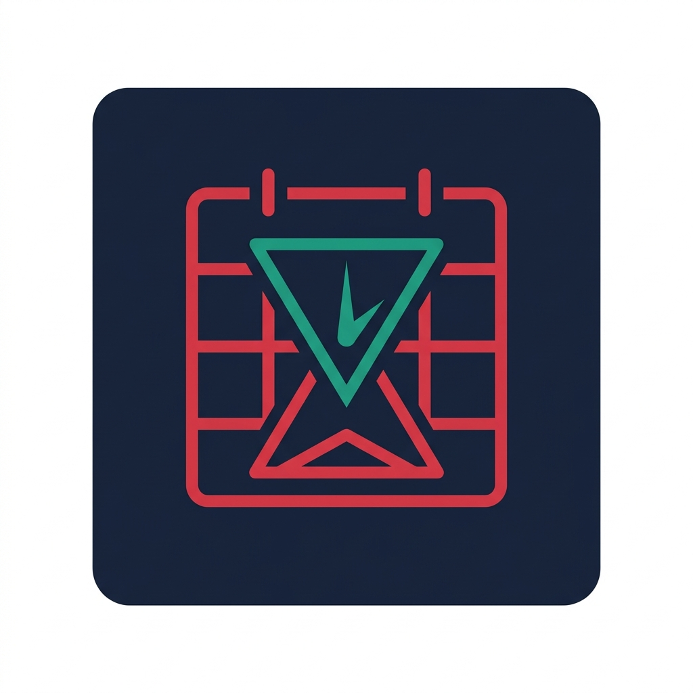

# Deadliner

<div align="center">
  
  <h3>Academic Hub & Google Calendar Synchronization Utility</h3>
  <p>
    <strong>Never miss a university deadline or class again.</strong><br>
    Unified, local-first aggregation of Moodle, Google Classroom, and KSE Schedule directly into your Google Calendar.
  </p>

  <p>
    <a href="https://github.com/vkatsel/deadliner/actions"></a>
    <a href="https://www.python.org/downloads/"></a>
    <a href="LICENSE"></a>
    <a href="https://vkatsel.github.io/deadliner/"></a>
    <a href="https://github.com/vkatsel/deadliner/releases/latest"></a>
  </p>
</div>

---

## 🎯 What is Deadliner?

Students often navigate fragmented platforms: **Moodle LMS** for assignments, **Google Classroom** for seminar tasks, and **KSE Schedule** for university timetable updates.

**Deadliner** is an ADHD- and anxiety-informed, local-first command-line tool that brings all academic obligations into a single, beautifully organized Google Calendar.

### ✨ Key Features

- 🎯 **All-in-One Academic Aggregation:** Collects upcoming deadlines from Moodle & Google Classroom and class schedules from schedule.kse.ua.
- 🎨 **Strict Visual Color Coding in Google Calendar:**
  - 🔴 **Tomato Red (`#D50000`, Color #11):** Deadlines & coursework (with unambiguous midnight cutoff indicators: e.g., `23:59 (midnight cutoff)`).
  - 🟢 **Sage Green (`#33B679`, Color #2):** KSE Lectures & standard academic classes.
  - 🔵 **Peacock Blue (`#039BE5`, Color #7):** KSE Practices, labs, and interactive seminars.
- ⚡ **1-Click KSE Schedule Sync:** Clipboard-assisted login that bypasses browser Cross-Origin restrictions with automatic JWT token refresh.
- 🧹 **Cancellation & Rescheduling Reconciliation:** Cancelled or moved KSE classes are automatically purged or updated in Google Calendar upon synchronization.
- ⏰ **24h Background Auto-Sync (Cron):** Zero-maintenance automated daily background synchronization via native Windows Task Scheduler or Unix crontab.
- ⚙️ **Granular Controls:** Ability to toggle Google Classroom sync on/off independently (`deadliner config classroom off`).
- 🔒 **Zero-Knowledge Privacy:** All tokens (`~/.deadliner.json`, `~/.deadliner_google_token.json`) are stored strictly on your machine. No telemetry, no third-party servers.

---

## 🚀 Quickstart

### 1. Installation

Clone the repository and install into your Python environment:

```bash
git clone https://github.com/vkatsel/deadliner.git
cd deadliner
pip install -e .
```

*Or install directly via pip:*
```bash
pip install git+https://github.com/vkatsel/deadliner.git
```

---

### 2. First Launch & Automatic PATH Configuration

When installing Python CLI tools via `pip`, Python places executable scripts into its internal scripts directory (e.g., `%APPDATA%\Python\Python3xx\Scripts\` on Windows or `~/.local/bin/` on macOS/Linux). On most systems, this directory is **not** included in the system `PATH` by default, causing terminal shells to report `deadliner: command not found`.

To solve this with zero manual environment variable editing, launch Deadliner for the first time using Python directly:

```bash
python -m deadliner
```

**What happens on first launch:**
Deadliner immediately detects that its binary is missing from your system `PATH` and presents a 1-click automatic setup prompt:
```text
==========================================================
  💡 Deadliner is not in your system PATH yet.
==========================================================
  Adding it allows you to type 'deadliner' from any terminal,
  without needing 'python -m deadliner'.
==========================================================
  Add 'deadliner' to PATH automatically? [Y/n]: 
```
Simply press **Enter** (`Y`):
- **Windows:** Permanently appends Python's Scripts folder to `HKCU\Environment\Path` in the Windows Registry and broadcasts `WM_SETTINGCHANGE` (no system reboot required).
- **macOS / Linux:** Automatically appends the export directive to `~/.bashrc` and `~/.zshrc`.

From this point forward, open any new terminal and simply type `deadliner` directly!

```bash
deadliner
```

```text
==========================================================
  DEADLINER — Academic Hub & Calendar Sync
==========================================================
[ Deadlines & Coursework ]
  1. Fetch upcoming deadlines (Moodle & Classroom)
  2. Sync deadlines to Google Calendar [Red]

[ KSE University Schedule ]
  3. Fetch KSE class schedule (Next 7 days)
  4. Sync KSE class schedule to Google Calendar [Green]

[ Automation & All-in-One ]
  5. Sync Everything [Deadlines + KSE Schedule]
  6. Auto-Sync Background Scheduler       [Active @ 08:00]

[ Account & Settings ]
  7. Login / Configure Services (Moodle / Google / KSE)
  8. Exit
==========================================================
Select an option [1-8]:
```

---

## 🔐 Authentication & Service Setup

Configure all services in one place via `deadliner menu` -> **Option 7**, or use standalone commands:

### 1. Moodle LMS
```bash
deadliner login moodle
```
- **Moodle URL:** `https://teaching.kse.org.ua` (press Enter to accept default).
- **Username & Password:** Enter your login credentials.
- *Tip for Google SSO users:* If you normally sign in with the Google button on the web, ensure your account has a local password set, or consult the setup prompt tip.

### 2. Google OAuth (Classroom & Calendar)
```bash
deadliner login google
```
- Deadliner prompts you to paste your Google OAuth `client_secret.json` or enter your Client ID & Secret directly.
- **Need a Google Cloud project?** Follow our step-by-step Ukrainian tutorial:
  - 📖 [Google Cloud Setup Guide (Markdown)](docs/specs/google_setup_guide.md)
  - 🌐 [Web Guide (HTML)](https://vkatsel.github.io/deadliner/google_setup_guide.html)
- *Import secrets directly without login:* `deadliner menu` -> Option `7` -> `e`.

### 3. KSE University Schedule
```bash
deadliner login kse
```
- Opens `schedule.kse.ua` in your browser.
- Open DevTools (`F12`) -> **Application** -> **Local Storage** -> Copy the `auth` token.
- Paste it into the terminal (or Deadliner reads it automatically from your clipboard with 1-click sync).
- Tokens are automatically refreshed in the background!

---

## 💻 Complete CLI Reference

| Command | Description |
|---|---|
| `deadliner` or `deadliner menu` | Open the interactive navigation menu |
| `deadliner fetch` | Print upcoming deadlines from Moodle and Google Classroom |
| `deadliner sync` | Sync deadlines to Google Calendar as Tomato Red events |
| `deadliner schedule fetch` | Print upcoming KSE classes (default: next 7 days) |
| `deadliner schedule fetch --days 14` | Fetch KSE schedule for a custom time range |
| `deadliner schedule sync` | Sync KSE classes to Google Calendar with color coding |
| `deadliner sync-all` | Run complete sync: deadlines + KSE class schedule |
| `deadliner config classroom [on\|off\|status]` | Enable, disable, or view Google Classroom sync state |
| `deadliner cron enable [--time HH:MM]` | Enable automated daily background synchronization (default: 08:00) |
| `deadliner cron status` | Check status of the background scheduler and next run time |
| `deadliner cron disable` | Remove background sync task |
| `deadliner logs` | View recent auto-sync execution logs (`~/.deadliner/sync.log`) |
| `deadliner login moodle` | Interactive Moodle login prompt |
| `deadliner login google` | Authenticate Google Calendar & Classroom via OAuth2 |
| `deadliner login kse` | Connect KSE university schedule account |
| `deadliner setup-path` | Permanently add `deadliner` to system PATH (Windows / Linux / macOS) |

---

## ⏰ 24h Background Auto-Sync

Never worry about opening the terminal before class. Deadliner integrates natively with your OS task scheduler:
- **Windows:** Configured via `schtasks` (runs silently in the background).
- **macOS / Linux:** Configured via native `crontab`.

```bash
# Enable daily sync every morning at 08:00 AM
deadliner cron enable --time 08:00

# Inspect recent background execution logs
deadliner logs
```

---

## 🛠️ Architecture & Development

Deadliner follows strict Clean Architecture and Single Responsibility principles:

```text
src/deadliner/
├── auth.py             # Moodle web service authentication & token management
├── calendar_sync.py    # Google Calendar synchronization, deduplication & color coding
├── classroom_fetcher.py# Google Classroom Coursework API client
├── cli.py              # CLI argument parser, interactive menu & subcommands
├── formatter.py        # Terminal formatting & midnight cutoff calculations
├── google_auth.py      # Google OAuth2 InstalledAppFlow & secrets management
├── kse_auth.py         # KSE schedule token extraction & auto-refresh
├── kse_fetcher.py      # KSE schedule REST API client
├── moodle_fetcher.py   # Moodle core_calendar API client
├── path_util.py        # Cross-platform PATH configuration & executable detection
└── scheduler.py        # OS-native task scheduler (Windows schtasks / Unix cron)
```

### Running Tests
Deadliner is backed by a comprehensive test suite (145 tests) with zero external network dependencies (mocked via `responses` and `monkeypatch`):

```bash
pytest
```

---

## ❓ FAQ & Troubleshooting

### Q: `deadliner: command not found` after running `pip install`?
**A:** If Python's `Scripts/` or `bin/` directory is not yet in your system PATH, run:
```bash
python -m deadliner setup-path
```
Deadliner will automatically detect your OS (Windows Registry or Linux/macOS `.bashrc`/`.zshrc`), configure your PATH permanently, and broadcast the environment update without requiring a full restart. You can also configure this from `deadliner menu` -> **Option 7** (`f`).

### Q: Google displays "Google hasn't verified this app" during login.
**A:** Because you created a personal Google Cloud project, Google displays this warning for unverified desktop apps. Click **Advanced** &rarr; **Go to Deadliner (unsafe)** &rarr; Grant calendar permissions. Your tokens remain strictly local on your machine.

### Q: Error 403: `access_denied` during Google login.
**A:** In your Google Cloud Console, ensure you added your personal email to the **Test Users** list under **OAuth Consent Screen**.

### Q: Can I use Deadliner without Google Classroom?
**A:** Yes! Run `deadliner config classroom off`. Deadliner will only fetch and sync Moodle deadlines and KSE classes.

---

## 📄 Legal & Compliance

- **Privacy Policy:** [docs/privacy.html](https://vkatsel.github.io/deadliner/privacy.html)
- **Terms of Service:** [docs/terms.html](https://vkatsel.github.io/deadliner/terms.html)
- **License:** [MIT License](LICENSE)
