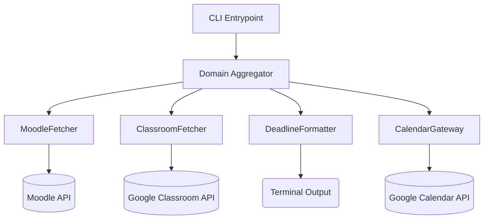

# docs/design_doc.md — Deadliner, v1

## §0 Metadata
- **Linked PRD version:** v1
- **Design version:** v1
- **Branch:** `team-typed-aura/stage1`
- **Language/Runtime:** Python 3.11+
- **AI role:** Architect

## §1 System sketch
Deadliner is a stateless CLI application that aggregates academic deadlines from multiple external sources (Moodle, Google Classroom) and either presents them in the terminal or pushes them to Google Calendar. The system consists of isolated fetching boundaries (`MoodleFetcher`, `ClassroomFetcher`), a pure domain aggregator that standardizes the raw data into canonical `Assignment` entities, and a `CalendarGateway` that handles idempotent mutations against the Google Calendar API. It avoids local state persistence (beyond config credentials), fetching fresh data on demand.



## §2 Core OOP entities

1. **`Assignment`**
   - **Responsibility:** A pure data entity representing a validated, parsed academic deadline extracted from a learning platform, enforcing timezone awareness.
   - **Key Methods:** No behavior methods (frozen dataclass).

2. **`MoodleFetcher`**
   - **Responsibility:** Scrapes Moodle via REST, filters out invalid/past tasks, and returns clean `Assignment` entities. Fails loudly on expired session tokens.
   - **Key Methods:** `fetch_upcoming(token: str) -> list[Assignment]`

3. **`ClassroomFetcher`**
   - **Responsibility:** Interacts with the Google Classroom API via OAuth tokens to extract assignments and return them as canonical `Assignment` entities.
   - **Key Methods:** `fetch_upcoming(oauth_creds: dict) -> list[Assignment]`

4. **`DeadlineFormatter`**
   - **Responsibility:** Turns a canonical `Assignment` into a human-readable display string, handling the local timezone conversion and 00:00 "midnight cutoff" detection.
   - **Key Methods:** `format_line(assignment: Assignment, now: datetime, local_tz: timezone) -> str`

5. **`CalendarGateway`**
   - **Responsibility:** Executes atomic, idempotent mutations against Google Calendar by translating `Assignment` entities into GCal Event payloads. It uses a stable `source_moodle_id` within the event's `extendedProperties` to map assignments exactly without relying on fuzzy title matching.
   - **Key Methods:** `push_events(assignments: list[Assignment]) -> None`, `get_active_tracking_ids() -> set[str]`

## §3 API surface (P0)

```python
def fetch_moodle(base_url: str, token: str) -> list[Assignment]:
    """
    Validates token and fetches assignments from Moodle.
    Inputs: base_url (str), token (str)
    Outputs: list of valid Assignment entities.
    Errors: Raises AuthError if token is rejected. Raises ConnectionError if unreachable.
    """

def fetch_classroom(oauth_credentials: dict) -> list[Assignment]:
    """
    Fetches assignments from Google Classroom using the OAuth dictionary.
    Inputs: OAuth credentials dictionary.
    Outputs: list of valid Assignment entities.
    Errors: Raises AuthError if OAuth token is revoked or expired.
    """

def format_assignment(assignment: Assignment, now: datetime, local_tz: timezone) -> str:
    """
    Returns a single formatted string for CLI output.
    Inputs: Assignment object, current datetime, target timezone.
    Outputs: Formatted string with the due date/time anchored at end-of-line, e.g. '[moodle] Math (midnight cutoff) — 2026-06-01 00:00'. The trailing timestamp is a parseable datetime, so a date embedded in a course name cannot be mistaken for the due date.
    Errors: Raises ValueError if the Assignment lacks a valid timezone.
    """
```

## §4 Trade-offs considered

| Option | Verdict | Why |
|---|---|---|
| **JSON flat file cache** | Picked (for local config & test mocking) / Rejected (for deadline storage) | Storing credentials in JSON is necessary. Storing actual deadlines in a cache was rejected because a stale cache that shows expired deadlines without warning is actively worse than a network error. We fetch live. |
| **Local SQLite DB** | Rejected | Extreme implementation complexity for a simple CLI tool; introduces the need for database schema migrations across the team's machines the moment a new column (like priority tags) is added. |
| **Stateless Live Fetch** | Picked | Guarantees zero stale-data risk. The product promise is a list the user can trust. A live fetch ensures the data exactly matches the learning platforms at the moment of invocation. |

## §5 What I'm not designing yet
- **Google Calendar Sync Loop:** Pushed to P1. The core `CalendarGateway` is stubbed, but the complex idempotent diffing logic (detecting what to create vs patch vs delete) is deferred until the core CLI aggregator is tested and stable.
- **Interactive Auth Flows:** The OAuth device code polling loop for Classroom is not designed yet; we assume the `credentials.json` is provided or created by a separate setup utility.

## §6 Test seam map

| P0 Surface | Test Type | Planned Test File |
|---|---|---|
| `fetch_moodle` | Integration / Contract | `tests/test_moodle_fetcher.py` (Mocking HTTP responses via `responses` or `responses` library to test `AuthError` and invalid data skipping) |
| `fetch_classroom` | Integration / Contract | `tests/test_classroom_fetcher.py` (Mocking the Google API client) |
| `format_assignment` | Unit (Pure Function) | `tests/test_formatter.py` (Passing fixed UTC datetimes and `Europe/Kyiv` timezone to verify "midnight cutoff" strings) |
| `CalendarGateway.push_events` | Integration | `tests/test_gateway.py` (Mocking the Google Calendar endpoints to verify payload structure without mutating real calendars) |

## §7 Rejected designs
**Local SQLite Event Sourcing Engine**
We seriously considered implementing a local SQLite database utilizing the Event Sourcing pattern. Every change detected in Moodle would generate an immutable event (`EventCreated`, `EventMutated`) published to a local message bus, and the CLI tool would replay these events to build a state hash tree to sync with Google Calendar. 

We abandoned this because it was a textbook over-build. It introduces the need for database schema migrations, transaction management, and local state drift resolution within what is fundamentally a data-pipeline CLI script. If the local SQLite database became desynchronized from the actual Google Calendar state, the system could not recover without a full state wipe anyway. Stateless execution pushes the source of truth back to Moodle where it belongs.
