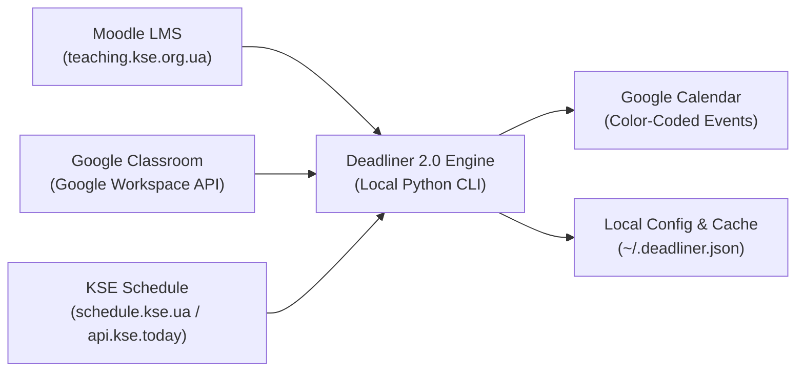
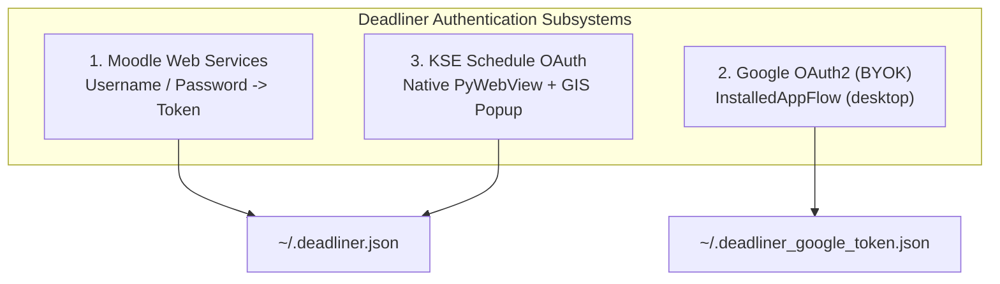

# Deadliner 2.0 Technical Specification & Architecture Document

**Version:** 2.0.0  
**Status:** Stable  
**Target Environment:** Python 3.10+, Cross-Platform (Windows, macOS, Linux)  
**Maintainer:** Vadym Katsel (`vkatsel@kse.org.ua`)  
**Repository:** [https://github.com/vkatsel/deadliner](https://github.com/vkatsel/deadliner)  

---

## 1. System Overview & Philosophy

Deadliner is an academic aggregation and calendar synchronization utility engineered for university students. It resolves cognitive fatigue, fragmented academic portals, and missed deadlines by unifying three independent university data streams into a single, color-coded Google Calendar:



### Core Design Principles
1. **Local-First & Zero-Knowledge:** Deadliner operates with zero cloud servers, telemetry, or external proxy services. All credentials, session tokens, and cache files reside strictly on the user's local disk (`~/.deadliner.json`, `~/.deadliner_google_token.json`).
2. **Deterministic Idempotency:** Sync operations can be run repeatedly without duplicating events or causing ghost entries. Every event is tagged with a stable tracking hash.
3. **Fail Loudly & Honest Feedback:** Silent 200 OK failures on invalid or expired authentication are strictly prohibited. The system immediately raises `AuthError` or `ConnectionError` with actionable resolution steps.
4. **Clean Architecture:** Strict separation between data fetchers, business formatters, synchronization engines, and OS-level task schedulers.

---

## 2. Authentication Architecture

Deadliner integrates three distinct authentication systems:



### 2.1 Moodle LMS Authentication (`auth.py`)
- Authenticates via Moodle Web Service token endpoint (`/login/token.php`).
- Service identifier: `moodle_mobile_app`.
- Stores `moodle_token` and `moodle_url`.

### 2.2 Google OAuth2 BYOK Architecture (`google_auth.py`)
- Uses Google's standard `InstalledAppFlow.from_client_secrets_file`.
- Scopes requested:
  - `https://www.googleapis.com/auth/calendar.events`
  - `https://www.googleapis.com/auth/classroom.coursework.me.readonly`
  - `https://www.googleapis.com/auth/classroom.courses.readonly`
- Tokens cached with automatic refresh: `~/.deadliner_google_token.json`.

### 2.3 KSE Schedule Authentication (`kse_auth.py`)
- **Native Embedded WebView Window:** Opens `https://schedule.kse.ua` in Microsoft Edge WebView2 (Windows) or WebKit (macOS/Linux).
- **Desktop User-Agent Spoofing:** Injects standard desktop Google Chrome User-Agent (`Mozilla/5.0... Chrome/133.0...`) into `AdditionalBrowserArguments` and `webview.start` to bypass embedded webview blocks (`disallowed_useragent`).
- **Native OAuth Popup Handling:** Intercepts `NewWindowRequested` in Edge WebView2 with `args.set_Handled(False)`. This spawns a native Google Sign-In popup with `window.opener` intact, allowing Google's completion script (`window.opener.postMessage`) to deliver the authorization code back to `schedule.kse.ua` and auto-close the popup window.
- **Safety-Net Code Capture:** Installs a DOM listener to catch `code=4/...` from `postMessage` or URL hash, exchanging it directly with `https://api.kse.today/auth/google`.
- **Token Rotation & Session Refresh:** Handles refreshToken rotation, snake_case/camelCase API responses, and auto-refreshes JWT access tokens upon 401 or expiration.

---

## 3. Data Ingestion & Models

### 3.1 Unified Assignment Model (`models.py`)
```python
@dataclass
class Assignment:
    title: str
    course_name: str
    due_utc: datetime
    url: str
    platform: str  # "moodle" | "classroom"
    course_shortname: str = ""
    is_submitted: bool = False
```

### 3.2 Schedule Class Model (`models.py`)
```python
@dataclass
class ScheduleClass:
    title: str
    start_time: datetime
    end_time: datetime
    classroom: str
    lecturer: str
    lesson_type: str  # "Lecture" | "Practice" | "Seminar"
    subgroup: str = ""
```

---

## 4. Google Calendar Synchronization Engine (`calendar_sync.py`)

### 4.1 Stable Event Identification
Events in Google Calendar are identified using private metadata:
- `extendedProperties.private.deadliner_id`: SHA-256 hash or deterministic UUID derived from assignment/class attributes.
- `extendedProperties.private.deadliner_type`: Identifies whether an event is a `deadline` or `schedule` entry, preventing schedule sync from mutating deadline events.

### 4.2 Visual Color Coding Standard
In accordance with student cognitive accessibility (ADHD/anxiety-informed design):
- 🔴 **Tomato Red (`colorId: 11`):** Academic deadlines and assignment cutoffs. Placed as a crisp 15-minute event pointing directly at the exact deadline moment.
- 🟢 **Sage Green (`colorId: 2`):** KSE Theory Lectures.
- 🔵 **Peacock Blue (`colorId: 7`):** KSE Practices, labs, and interactive seminars.

### 4.3 Intelligent Rescheduling & Reconciliation
1. **Rescheduling:** If an assignment's due date is modified on Moodle or Classroom, Deadliner detects the timestamp divergence, updates the calendar event's start/end times in place, and logs `(old_due ➜ new_due)` to `~/.deadliner/sync.log`.
2. **Cancellation:** For KSE schedule events, Deadliner inspects the synchronization window (e.g. next 7 days). Any previously synced class event missing from the current university schedule is safely deleted.

---

## 5. Background Automation Engine (`scheduler.py`)

Deadliner integrates natively with operating system task schedulers:
- **Windows:** Configured via `schtasks.exe`. Uses `pythonw.exe` for silent, windowless background execution to avoid popping up command windows.
- **UNIX / macOS:** Configured via native user `crontab`.
- **Audit Logging:** Every execution appends structured timestamped logs to `~/.deadliner/sync.log`.

---

## 6. Testing & Quality Standards

- **100% Mocked Isolation:** All network requests to Moodle, Google, and KSE APIs are mocked using `responses` and `monkeypatch`.
- **Execution Speed:** Complete test suite (170 unit tests) runs in under 6 seconds on commodity hardware.
- **Regression Prevention:** Strict type annotations (`from __future__ import annotations`, `mypy`-compatible), zero warnings, and clean test teardown.
